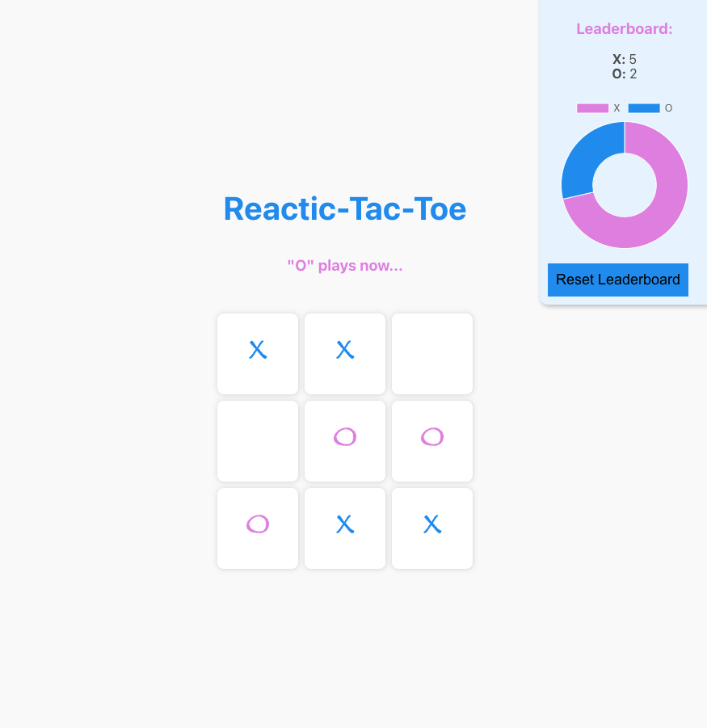

# TIC-TAC-TOE Project



### Instructions

Install project:
```js
yarn  // or npm install
```

Run project:
```js
yarn start // or npm start
```

Run Tests (Headless):
```js
// In one terminal instance run:
yarn start // or npm start

// In other terminal instance run:
yarn test // or npm test
```

Run Tests (Browser):
```js
// In one terminal instance run:
yarn start // or npm start

// In other terminal instance run:
yarn test:browser // or npm test

// After the Cypress window be opened, click "E2E Testing", then choose a Browser to run all the tests and click "Start E2e Testing in Chrome"
```

### Features:

- This App was made using React and React Hooks;
- A simple two player Tic Tac web application;
- The game take player input and declare a winner when three X’s or O’s align;
- After a winner, allow for another game;
- Track wins and loses while the app is running;
- There's a navigation to other random dummy page (About);
- There's a charting tool measuring all the Wins;
- It includes the basics of HTML, CSS, and javascript;

### Troubleshooting

- Check if Yarn (or NPM) is installed correctly.
- email to **diogocercilio@gmail.com**